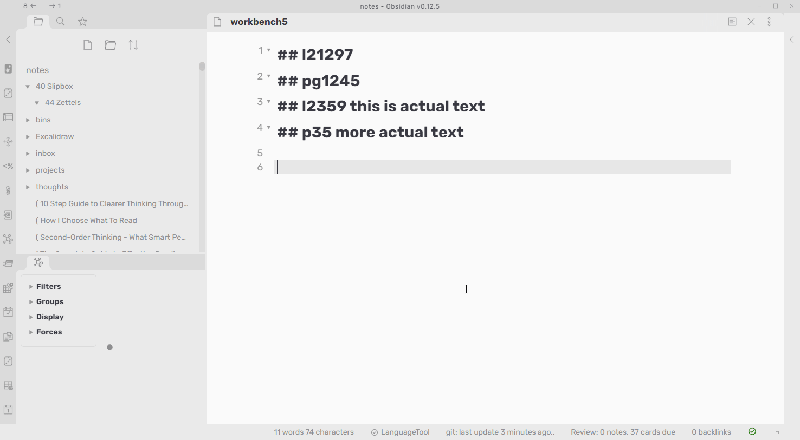

You can get the `.js` file for this userscript [here](./Attachments/zettelizer.js).
To install it, you can follow the same process as in the [fetch tasks from Todoist example - with video](./Capture_FetchTasksFromTodoist.md).

## Setup
You will need to define the folder you want the script to place the new notes in.

This can be done on line 19, where it says ``const folder = "..."``. Change the text inside the `""` to match the desired folder path.

Currently, the script _only_ looks for level 3 headers. This means headers with three pound symbols, like so ``### header``.

You can freely change this. On line 29 it says ``if (heading.level === 3)``. You can change this to any other number, denoting the heading level desired. You can also, rather than checking for equality (`===`), check for other conditions, such as `heading.level >= 1`, which denotes headers of level 1 or greater.

The script looks for headers in your active file with the desired level.
If such a header is found, it will ignore the first 'word' (any sequence of characters - i.e., letters, numbers, symbols, etc - followed by a space). Then, it will create a file with a name containing the remaining text in the heading.

In that file, it will link to the heading it created the file from.